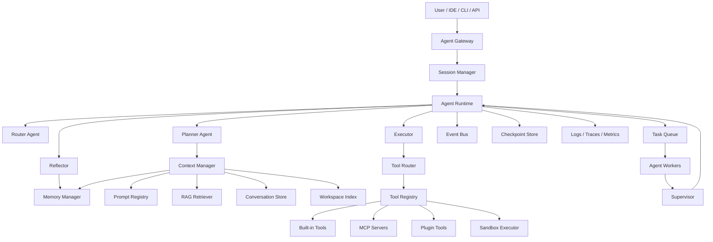
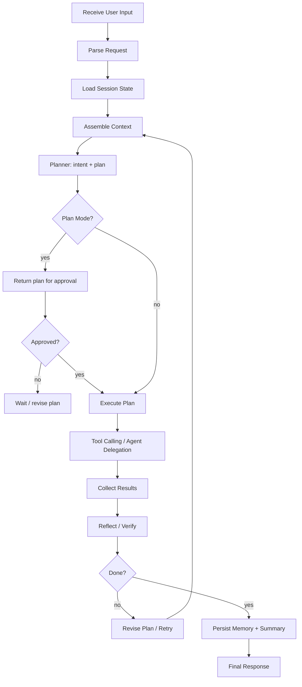
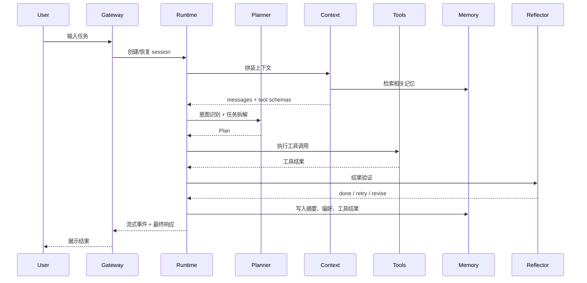
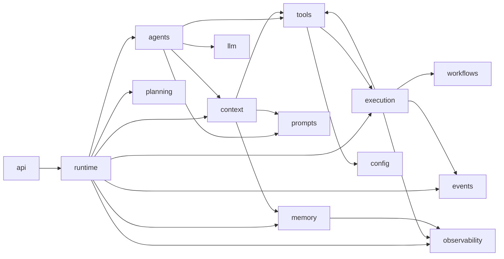
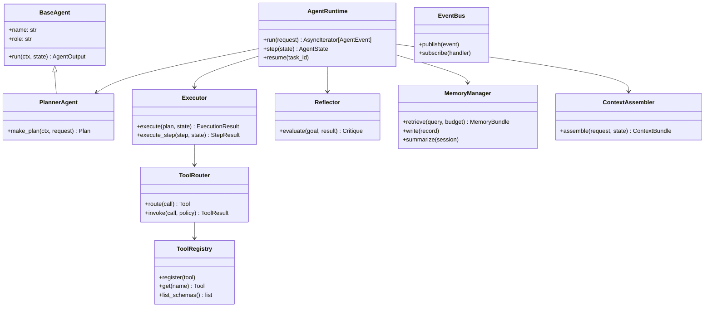
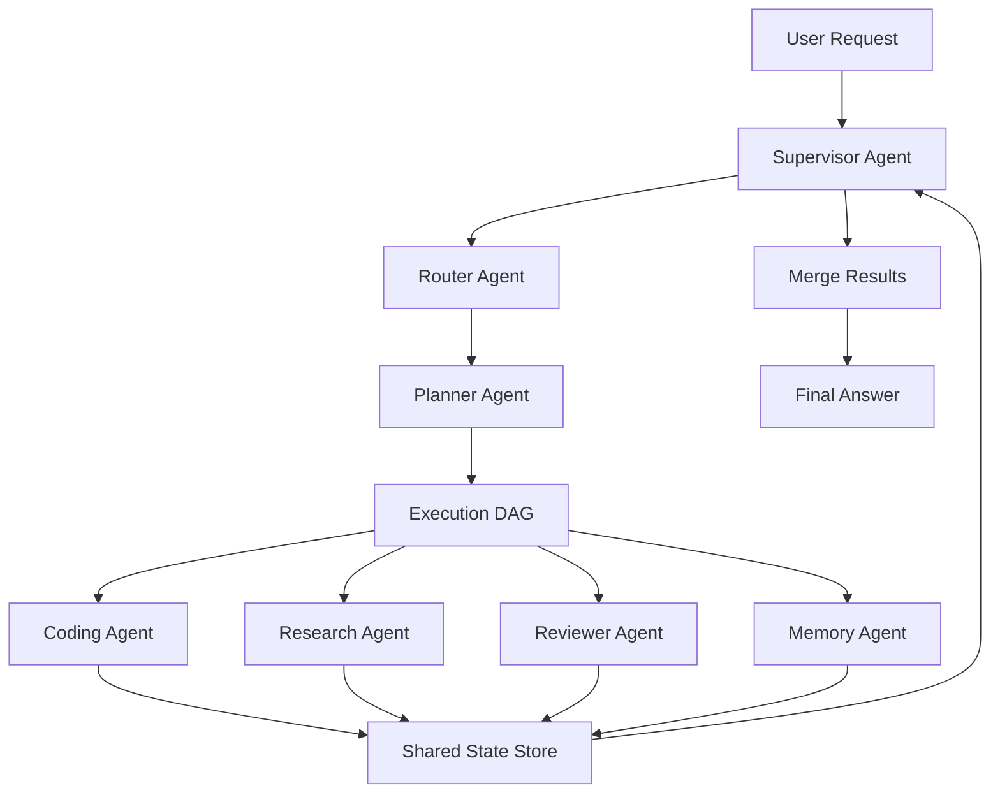
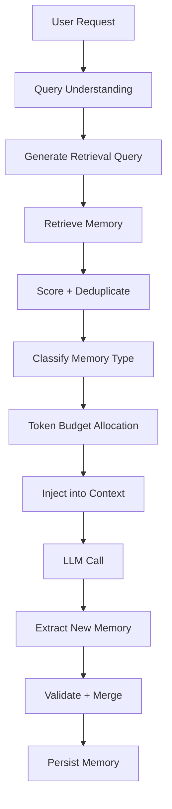
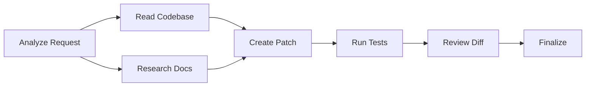

# Python 生产级 AI Agent 架构设计方案

> 目标：参考 Claude Code、Codex、Cursor Agent 等现代 Agent 产品的公开设计思想，给出一套可工程化、可扩展、可观测、可治理的 Python Agent 系统架构。本文不是简单 Demo，而是面向生产系统的架构蓝图、模块划分、核心流程和代码骨架。

## 0. 设计原则

### 0.1 核心目标

- 支持 `Planner -> Executor -> Reflector` 的 Agent 主循环。
- 支持单 Agent、多 Agent、Supervisor、多工具、多记忆、多上下文源。
- 支持长任务、流式输出、任务恢复、权限控制、沙箱执行、人工确认。
- 支持插件化工具、MCP 风格工具协议、Prompt Registry、Memory Registry。
- 支持日志、追踪、评估、回放、Checkpoint、错误恢复。

### 0.2 参考产品抽象

Claude Code、Codex、Cursor Agent 的共同模式可以抽象为：

- 终端或 IDE 内的 Agent Harness：模型负责推理，宿主系统负责工具、上下文、权限、执行环境、持久化。
- 主循环不是一次问答，而是持续的 `观察 -> 思考 -> 行动 -> 观察 -> 修正`。
- Plan Mode / Ask Mode：先只读探索和规划，再由用户批准后执行。
- Tool Use：文件、搜索、终端、Web、MCP、代码智能、子 Agent 都是工具。
- Context Window 管理：系统指令、开发者指令、记忆、历史、RAG、工具结果动态拼装。
- Memory 文件和自动记忆：长期规则、项目约定、用户偏好从会话历史中剥离出来。
- Subagent 隔离：复杂任务可以让子 Agent 在独立上下文内执行，主 Agent 只接收摘要。
- Permission / Sandbox：不同工具按风险分级，写文件、执行命令、联网、访问外部系统需要策略控制。

## 1. 总体架构

### 1.1 逻辑架构图



### 1.2 核心模块

| 模块 | 责任 | 关键对象 |
| --- | --- | --- |
| Agent Gateway | 接收 CLI、Web、IDE、API 请求 | `AgentGateway`, `UserRequest` |
| Session Manager | 会话、用户、项目、工作区绑定 | `Session`, `SessionStore` |
| Agent Runtime | 主循环、状态机、流式事件 | `AgentRuntime`, `AgentState` |
| Planner | 意图识别、任务拆解、执行计划 | `PlannerAgent`, `Plan`, `Step` |
| Executor | 执行步骤、调用工具、并发调度 | `Executor`, `ExecutionResult` |
| Reflector | 校验、反思、重试、总结 | `Reflector`, `Critique` |
| Tool System | 工具注册、路由、权限、沙箱 | `ToolRegistry`, `ToolRouter`, `Sandbox` |
| Memory System | 短期、长期、向量、文件、工具结果记忆 | `MemoryManager`, `MemoryStore` |
| Context Manager | 动态上下文拼装、裁剪、压缩 | `ContextAssembler`, `TokenBudget` |
| Task Queue | 长任务、异步任务、DAG 工作流 | `TaskQueue`, `WorkflowEngine` |
| Prompt Registry | 模板、版本、变量、灰度 | `PromptRegistry`, `PromptTemplate` |
| Event Bus | 内部事件、状态同步、观测 | `EventBus`, `AgentEvent` |

## 2. Agent 核心循环

### 2.1 主循环流程图



### 2.2 Planner -> Executor -> Reflector

#### Planner

Planner 不直接修改外部世界。它负责：

- 识别用户意图：问答、编码、调研、调试、重构、执行命令、数据处理。
- 判断执行模式：Ask、Plan、Act、Review、Background。
- 生成结构化计划：目标、约束、步骤、依赖、风险、验收标准。
- 标注每一步需要的工具、权限和上下文。

#### Executor

Executor 是行动层。它负责：

- 按计划执行步骤。
- 调用工具、子 Agent、工作流、外部服务。
- 管理超时、并发、重试、取消。
- 记录工具输入输出、状态变更、文件 diff、命令日志。

#### Reflector

Reflector 是验证和自我修正层。它负责：

- 判断结果是否满足目标和验收标准。
- 检查工具结果是否异常或不完整。
- 对代码任务运行测试、静态分析、格式化、review。
- 生成修正建议，必要时回到 Planner 或 Executor。
- 提炼可写入 Memory 的新知识。

### 2.3 ReAct 模式

生产系统中不建议让模型直接输出自由文本 ReAct 日志，而是让运行时维护结构化轨迹：

```text
Observation: 用户需求、上下文、工具结果
Thought: 模型内部推理，不持久化明文或只持久化摘要
Action: 结构化工具调用或子 Agent 调用
Result: 工具返回、错误、状态变化
Reflection: 对结果的检查和下一步决策
```

建议对外暴露的是可审计事件，而不是完整推理链：

```json
{
  "event": "tool_call.completed",
  "tool": "shell.run",
  "status": "success",
  "duration_ms": 1280,
  "summary": "pytest 通过 42 个测试"
}
```

## 3. Agent 生命周期设计

### 3.1 生命周期全景



### 3.2 阶段说明

| 阶段 | 输入 | 输出 | 失败处理 |
| --- | --- | --- | --- |
| 用户输入解析 | 原始文本、附件、工作区、模式 | `UserRequest` | 请求补充、拒绝危险请求 |
| 意图识别 | 请求、历史、上下文 | `Intent` | 降级为问答或 Plan Mode |
| 任务拆解 | 目标、约束、上下文 | `Plan` | 重新规划、请求人工确认 |
| 执行规划 | Plan、工具能力、权限 | `ExecutionGraph` | 缺工具、缺权限、改用替代方案 |
| 工具调用 | ToolCall | ToolResult | 超时、重试、权限升级、沙箱错误 |
| 结果反思 | 目标、结果、验收标准 | `Critique` | 修正计划、补充验证、回滚 |
| 错误恢复 | 异常、状态、Checkpoint | 恢复动作 | 重试、降级、人工介入 |
| 长任务运行 | Task、Session、Workflow | 事件流、检查点 | 恢复、暂停、取消、重新入队 |

### 3.3 长任务持续运行

长任务不应依赖单次 LLM 调用或单进程内存。推荐设计：

- 每个任务有 `task_id`、`session_id`、`workflow_id`。
- 每个步骤执行前创建 Checkpoint。
- 每个工具调用结果写入 `ToolResultStore`。
- 每轮 Agent 产生 `StateSnapshot`。
- Worker 崩溃后从最近 Checkpoint 恢复。
- 用户可以 `pause / resume / cancel / fork`。

## 4. 目录结构建议

```text
agent_system/
  pyproject.toml
  README.md
  configs/
    default.yaml
    dev.yaml
    prod.yaml
    permissions.yaml
    prompts.yaml
  src/
    agent_system/
      __init__.py
      app.py
      config/
        loader.py
        models.py
      runtime/
        loop.py
        state.py
        session.py
        checkpoint.py
      agents/
        base.py
        router.py
        planner.py
        coding.py
        research.py
        memory.py
        reviewer.py
        tool_agent.py
        supervisor.py
      planning/
        models.py
        planner.py
        dag.py
      execution/
        executor.py
        scheduler.py
        retry.py
        permissions.py
        sandbox.py
      tools/
        base.py
        registry.py
        router.py
        schemas.py
        builtin/
          file.py
          shell.py
          grep.py
          web.py
        mcp/
          client.py
          server.py
          adapters.py
      memory/
        manager.py
        stores.py
        vector.py
        conversation.py
        workspace.py
        summarizer.py
      context/
        assembler.py
        budget.py
        compression.py
        ranking.py
      prompts/
        registry.py
        templates/
          system.md
          planner.md
          executor.md
          reflector.md
      events/
        bus.py
        models.py
        handlers.py
      workflows/
        engine.py
        queue.py
        dag_runner.py
      observability/
        logging.py
        tracing.py
        metrics.py
      llm/
        client.py
        models.py
        streaming.py
      api/
        http.py
        websocket.py
        cli.py
  tests/
    unit/
    integration/
    evals/
```

## 5. 模块依赖关系



依赖原则：

- `agents` 不直接访问数据库，统一走 `memory`、`context`、`tools`。
- `tools` 不直接调用 LLM，除非是显式的 `ToolAgent` 或 MCP 代理。
- `runtime` 是编排层，不实现具体业务工具。
- `context` 只负责选材和拼装，不做复杂任务决策。
- `execution` 负责副作用治理：权限、沙箱、超时、重试、审计。

## 6. Python 类关系设计



## 7. 核心数据模型示例

```python
from __future__ import annotations

from enum import Enum
from typing import Any, AsyncIterator, Callable, Literal
from pydantic import BaseModel, Field


class RunMode(str, Enum):
    ASK = "ask"
    PLAN = "plan"
    ACT = "act"
    REVIEW = "review"
    BACKGROUND = "background"


class UserRequest(BaseModel):
    session_id: str
    user_id: str
    workspace_id: str
    content: str
    mode: RunMode = RunMode.ACT
    attachments: list[str] = Field(default_factory=list)
    metadata: dict[str, Any] = Field(default_factory=dict)


class Step(BaseModel):
    id: str
    title: str
    objective: str
    depends_on: list[str] = Field(default_factory=list)
    suggested_tools: list[str] = Field(default_factory=list)
    risk: Literal["low", "medium", "high"] = "low"
    acceptance: list[str] = Field(default_factory=list)


class Plan(BaseModel):
    goal: str
    mode: RunMode
    steps: list[Step]
    assumptions: list[str] = Field(default_factory=list)
    risks: list[str] = Field(default_factory=list)


class ToolCall(BaseModel):
    id: str
    name: str
    arguments: dict[str, Any]
    timeout_s: float = 30
    requires_approval: bool = False


class ToolResult(BaseModel):
    call_id: str
    name: str
    ok: bool
    content: Any
    error: str | None = None
    metadata: dict[str, Any] = Field(default_factory=dict)


class Critique(BaseModel):
    done: bool
    confidence: float
    issues: list[str] = Field(default_factory=list)
    next_action: Literal["finish", "retry", "replan", "ask_user"] = "finish"


class AgentState(BaseModel):
    session_id: str
    task_id: str
    mode: RunMode
    plan: Plan | None = None
    completed_steps: set[str] = Field(default_factory=set)
    tool_results: list[ToolResult] = Field(default_factory=list)
    iteration: int = 0
    max_iterations: int = 20
```

## 8. 主循环伪代码

```python
class AgentRuntime:
    def __init__(
        self,
        planner: PlannerAgent,
        executor: Executor,
        reflector: Reflector,
        context: ContextAssembler,
        memory: MemoryManager,
        event_bus: EventBus,
        checkpoints: CheckpointStore,
    ) -> None:
        self.planner = planner
        self.executor = executor
        self.reflector = reflector
        self.context = context
        self.memory = memory
        self.event_bus = event_bus
        self.checkpoints = checkpoints

    async def run(self, request: UserRequest) -> AsyncIterator[AgentEvent]:
        state = await self._load_or_create_state(request)
        yield AgentEvent(type="run.started", data={"task_id": state.task_id})

        while state.iteration < state.max_iterations:
            state.iteration += 1
            await self.checkpoints.save(state)

            ctx = await self.context.assemble(request=request, state=state)

            if state.plan is None or self._needs_replan(state):
                state.plan = await self.planner.make_plan(ctx, request)
                yield AgentEvent(type="plan.created", data=state.plan.model_dump())

                if state.mode == RunMode.PLAN:
                    yield AgentEvent(type="run.waiting_for_approval", data={})
                    return

            execution = await self.executor.execute(state.plan, state)
            state.tool_results.extend(execution.tool_results)
            yield AgentEvent(type="execution.completed", data=execution.summary())

            critique = await self.reflector.evaluate(
                goal=state.plan.goal,
                result=execution,
                context=ctx,
            )
            yield AgentEvent(type="reflection.completed", data=critique.model_dump())

            if critique.done:
                await self.memory.write_run_summary(request, state, execution)
                yield AgentEvent(type="run.completed", data={"confidence": critique.confidence})
                return

            if critique.next_action == "ask_user":
                yield AgentEvent(type="run.needs_user_input", data={"issues": critique.issues})
                return

            if critique.next_action == "replan":
                state.plan = None

        yield AgentEvent(
            type="run.stopped",
            data={"reason": "max_iterations", "iterations": state.iteration},
        )
```

## 9. 多 Agent 设计

### 9.1 Agent 类型

| Agent | 主要职责 | 输入 | 输出 |
| --- | --- | --- | --- |
| Router Agent | 判断请求路由和模式 | 用户请求、会话状态 | 目标 Agent、模式、优先级 |
| Planner Agent | 拆解任务、生成计划 | 上下文、意图 | Plan / DAG |
| Coding Agent | 读写代码、测试、修复 | Plan Step、代码上下文 | Patch、测试结果 |
| Research Agent | Web/RAG/文档检索 | 调研问题 | 证据摘要、引用 |
| Memory Agent | 记忆提取、去重、写入 | 会话、结果、用户反馈 | MemoryRecord |
| Reviewer Agent | 代码审查、安全检查 | Diff、测试结果 | ReviewFinding |
| Tool Agent | 包装复杂工具链 | ToolCall、工具上下文 | ToolResult |
| Supervisor Agent | 任务分派、冲突解决 | 全局状态、子任务结果 | 决策、合并、终止 |

### 9.2 Supervisor 模式



### 9.3 Agent 间通信机制

推荐使用事件驱动和结构化消息，而不是直接函数互相调用。

```python
class AgentMessage(BaseModel):
    id: str
    trace_id: str
    sender: str
    receiver: str
    type: Literal["request", "response", "event", "error"]
    payload: dict[str, Any]
    context_refs: list[str] = Field(default_factory=list)
    created_at: float
```

通信通道：

- 同进程：`asyncio.Queue` 或内存 EventBus。
- 单机多进程：Redis Streams、NATS、RabbitMQ。
- 分布式：Kafka、NATS JetStream、Temporal Signals。
- 高审计场景：所有消息写入 Append-only Event Store。

### 9.4 状态共享

共享状态不要直接共享完整 Prompt 或完整上下文，使用引用：

```text
SharedState
  task_id
  goal
  plan_id
  workspace_snapshot_id
  memory_refs[]
  artifact_refs[]
  tool_result_refs[]
  checkpoints[]
```

好处：

- 子 Agent 上下文隔离，避免主上下文膨胀。
- 大文件、大工具结果只传引用。
- 支持权限检查：不同 Agent 只能读取授权引用。
- 支持重放和追踪。

### 9.5 并发执行

可并发的步骤需要满足：

- 没有文件写冲突。
- 没有同一外部资源写冲突。
- 依赖步骤已完成。
- 权限级别允许后台执行。

```python
class DagScheduler:
    async def run(self, graph: ExecutionGraph, state: AgentState) -> ExecutionResult:
        ready = graph.ready_steps(completed=state.completed_steps)
        async with asyncio.TaskGroup() as tg:
            for step in ready:
                if self.lock_manager.can_acquire(step.resources):
                    tg.create_task(self.executor.execute_step(step, state))
```

## 10. Tool Calling 设计

### 10.1 Tool Schema

工具必须声明：

- 名称、描述、输入 JSON Schema、输出类型。
- 风险等级、权限需求、超时、是否可缓存。
- 是否支持流式输出、取消、重试。
- 是否可在 Plan Mode 使用。

```python
class ToolPermission(BaseModel):
    filesystem: Literal["none", "read", "write"] = "none"
    network: Literal["none", "allowlist", "full"] = "none"
    shell: bool = False
    external_side_effect: bool = False
    approval_required: bool = False


class ToolSchema(BaseModel):
    name: str
    description: str
    input_schema: dict[str, Any]
    output_schema: dict[str, Any] | None = None
    risk: Literal["low", "medium", "high"]
    permission: ToolPermission
    timeout_s: float = 30
    cache_ttl_s: int | None = None
    read_only: bool = True
```

### 10.2 Tool 基类

```python
class BaseTool:
    schema: ToolSchema

    async def run(self, arguments: dict[str, Any], ctx: ToolContext) -> ToolResult:
        raise NotImplementedError


class ToolRegistry:
    def __init__(self) -> None:
        self._tools: dict[str, BaseTool] = {}

    def register(self, tool: BaseTool) -> None:
        if tool.schema.name in self._tools:
            raise ValueError(f"duplicate tool: {tool.schema.name}")
        self._tools[tool.schema.name] = tool

    def get(self, name: str) -> BaseTool:
        return self._tools[name]

    def schemas(self, *, mode: RunMode) -> list[ToolSchema]:
        if mode == RunMode.PLAN:
            return [t.schema for t in self._tools.values() if t.schema.read_only]
        return [t.schema for t in self._tools.values()]
```

### 10.3 Tool Router

```python
class ToolRouter:
    def __init__(
        self,
        registry: ToolRegistry,
        permission: PermissionEngine,
        sandbox: SandboxExecutor,
        cache: ToolResultCache,
        events: EventBus,
    ) -> None:
        self.registry = registry
        self.permission = permission
        self.sandbox = sandbox
        self.cache = cache
        self.events = events

    async def invoke(self, call: ToolCall, ctx: ToolContext) -> ToolResult:
        tool = self.registry.get(call.name)

        decision = await self.permission.check(tool.schema.permission, ctx)
        if decision.requires_user_approval:
            raise ApprovalRequired(call=call, reason=decision.reason)

        cache_key = self.cache.key_for(call) if tool.schema.cache_ttl_s else None
        if cache_key:
            cached = await self.cache.get(cache_key)
            if cached:
                return cached

        await self.events.publish(AgentEvent(type="tool.started", data=call.model_dump()))

        try:
            result = await self.sandbox.run_tool(tool, call.arguments, ctx, timeout_s=call.timeout_s)
        except TimeoutError as exc:
            result = ToolResult(call_id=call.id, name=call.name, ok=False, content=None, error=str(exc))

        if cache_key and result.ok:
            await self.cache.set(cache_key, result, ttl_s=tool.schema.cache_ttl_s)

        await self.events.publish(AgentEvent(type="tool.completed", data=result.model_dump()))
        return result
```

### 10.4 MCP 风格设计

MCP 风格工具层可以抽象为：

```text
MCP Server
  resources/list
  resources/read
  tools/list
  tools/call
  prompts/list
  prompts/get
```

建议实现方式：

- 内部工具也走统一协议，便于远程化。
- MCP Server 只暴露工具 schema 和执行入口，不直接暴露数据库连接。
- 对每个 MCP Server 做命名空间隔离：`github.create_issue`、`jira.search`。
- 支持工具延迟加载：默认只给模型工具名和简短描述，命中后再加载完整 schema。

### 10.5 Sandbox 执行

沙箱维度：

- 文件系统：只读、工作区写、临时目录写、禁止访问敏感路径。
- 网络：禁用、域名 allowlist、完整网络。
- 进程：CPU、内存、时间、子进程数量限制。
- 凭证：按工具注入最小权限 token。
- 审计：记录命令、环境、输入、输出摘要。

推荐策略：

| 风险 | 示例 | 策略 |
| --- | --- | --- |
| 低 | 读文件、grep、列目录 | 自动允许 |
| 中 | 写工作区文件、运行测试 | 可配置自动允许 |
| 高 | 删除文件、部署、数据库写、联网提交 | 人工批准 |
| 禁止 | 读取密钥、越权路径、破坏性系统命令 | 拒绝 |

## 11. Memory 系统设计

### 11.1 Memory 类型

| 类型 | 内容 | 存储 | 生命周期 |
| --- | --- | --- | --- |
| Short-term Memory | 当前任务状态、临时发现 | Redis / DB / 内存 | 单任务 |
| Conversation Memory | 对话摘要、用户偏好 | Postgres / SQLite | 多会话 |
| Long-term Memory | 稳定事实、项目规则 | Postgres / Markdown | 长期 |
| Vector Memory | 语义检索片段 | pgvector / Qdrant / Milvus | 长期 |
| Workspace Memory | 项目结构、依赖、测试命令 | 文件索引 / DB | 随工作区更新 |
| File Memory | 重要文件摘要、符号索引 | SQLite / Tantivy / BM25 | 随文件更新 |
| Tool Result Memory | 命令结果、检索结果、运行日志摘要 | Object Store / DB | 有 TTL |

### 11.2 Memory 注入流程



### 11.3 Memory 写入策略

不要把所有对话都写入长期记忆。建议使用 Memory Agent 进行筛选：

写入条件：

- 用户明确表达偏好：例如“以后都使用 pytest”。
- 项目稳定事实：构建命令、目录结构、架构约定。
- 反复出现的问题和解决方式。
- 长任务阶段性结论。

不写入：

- 临时中间结果。
- 敏感信息、密钥、个人隐私。
- 未验证的模型猜测。
- 与项目无关的闲聊。

```python
class MemoryRecord(BaseModel):
    id: str
    scope: Literal["user", "workspace", "session", "agent"]
    kind: Literal["preference", "fact", "summary", "tool_result", "decision"]
    content: str
    source_refs: list[str] = Field(default_factory=list)
    confidence: float = 1.0
    ttl_s: int | None = None
    tags: list[str] = Field(default_factory=list)
```

## 12. Context 管理

### 12.1 上下文层级

上下文拼装顺序建议：

```text
1. SYSTEM
2. DEVELOPER
3. SECURITY / POLICY
4. MEMORY
5. RAG CONTEXT
6. WORKSPACE CONTEXT
7. HISTORY SUMMARY
8. RECENT HISTORY
9. TOOL RESULTS
10. USER INPUT
11. AVAILABLE TOOLS
```

说明：

- `SYSTEM`：不可被用户覆盖的全局行为约束。
- `DEVELOPER`：产品、工程、风格、权限策略。
- `MEMORY`：长期规则、偏好、项目事实。
- `RAG CONTEXT`：当前问题相关文档。
- `HISTORY`：最近对话和压缩摘要。
- `TOOL RESULTS`：最近且必要的工具结果。
- `USER INPUT`：当前用户请求，应靠近末尾。

### 12.2 动态拼装算法

```python
class ContextAssembler:
    async def assemble(self, request: UserRequest, state: AgentState) -> ContextBundle:
        budget = TokenBudget(total=self.model_context_limit)

        system = await self.prompts.render("system", request=request)
        developer = await self.prompts.render("developer", request=request)
        budget.reserve("system", system)
        budget.reserve("developer", developer)

        memory = await self.memory.retrieve(request.content, budget=budget.slice("memory"))
        rag = await self.rag.retrieve(request.content, budget=budget.slice("rag"))
        workspace = await self.workspace.summarize(request.workspace_id, budget=budget.slice("workspace"))
        history = await self.history.load_relevant(request.session_id, budget=budget.slice("history"))
        tool_results = self._select_tool_results(state.tool_results, budget=budget.slice("tools"))

        messages = [
            {"role": "system", "content": system},
            {"role": "developer", "content": developer},
            {"role": "system", "name": "memory", "content": memory.to_prompt()},
            {"role": "system", "name": "rag_context", "content": rag.to_prompt()},
            {"role": "system", "name": "workspace", "content": workspace.to_prompt()},
            *history.to_messages(),
            *tool_results.to_messages(),
            {"role": "user", "content": request.content},
        ]

        return ContextBundle(messages=messages, budget=budget)
```

### 12.3 避免上下文爆炸

核心策略：

- 引用优先：大文件、大日志、大检索结果进入对象存储，Prompt 中只放摘要和引用 ID。
- 先检索后注入：Memory、RAG、工具定义都按需加载。
- 分层摘要：会话摘要、任务摘要、工具结果摘要、文件摘要分开维护。
- 最近优先 + 相关性优先：最近历史不等于全部历史。
- 子 Agent 隔离：子 Agent 独立上下文，主 Agent 只接收结果摘要。
- 工具结果 TTL：命令输出、Web 结果、日志片段默认过期。
- Token 预算硬限制：每个上下文源有最大预算，不允许挤占系统和用户输入。
- 压缩失败保护：若反复压缩后仍超限，停止自动循环并要求缩小范围。

## 13. Prompt 管理机制

### 13.1 Prompt Registry

Prompt 不应散落在代码里。建议支持：

- 模板版本：`planner:v3`、`reflector:v2`。
- 变量渲染：Jinja2 或 f-string 风格。
- 作用域：全局、项目、用户、Agent、工具。
- A/B 实验和灰度。
- Prompt 单元测试和快照测试。

```python
class PromptTemplate(BaseModel):
    name: str
    version: str
    role: Literal["system", "developer", "user"]
    template: str
    variables: list[str]
    tags: list[str] = Field(default_factory=list)


class PromptRegistry:
    async def render(self, name: str, version: str | None = None, **kwargs: Any) -> str:
        template = await self.load(name, version)
        return self.renderer.render(template.template, **kwargs)
```

### 13.2 Prompt 分层

```text
system.md
  - 身份、边界、安全要求、输出协议

developer.md
  - 工程规范、工具策略、交互风格

planner.md
  - 如何拆任务、如何识别风险、如何生成 Plan

executor.md
  - 如何调用工具、如何处理失败、如何记录结果

reflector.md
  - 如何验证、如何重试、如何总结

memory.md
  - 什么可记、什么不可记、如何合并旧记忆
```

## 14. Task 调度与 Workflow

### 14.1 任务模型

```python
class TaskStatus(str, Enum):
    PENDING = "pending"
    RUNNING = "running"
    WAITING_APPROVAL = "waiting_approval"
    WAITING_INPUT = "waiting_input"
    COMPLETED = "completed"
    FAILED = "failed"
    CANCELLED = "cancelled"


class AgentTask(BaseModel):
    id: str
    session_id: str
    workspace_id: str
    status: TaskStatus
    priority: int = 100
    parent_task_id: str | None = None
    checkpoint_id: str | None = None
    lease_until: float | None = None
```

### 14.2 DAG 执行



适合 DAG 的任务：

- 调研多个文档源。
- 多文件并行分析。
- 测试矩阵。
- 多 Agent 评审。
- 数据处理流水线。

不适合并发的任务：

- 同一文件的多处写入。
- 依赖前一步判断的探索任务。
- 高风险外部副作用。

## 15. 错误恢复、Retry、Checkpoint

### 15.1 错误分类

| 错误 | 示例 | 恢复策略 |
| --- | --- | --- |
| LLM 输出格式错误 | JSON 解析失败 | 结构化重试、降低自由度 |
| 工具超时 | 命令卡住 | 取消、缩小范围、增加超时 |
| 权限不足 | 需要写文件/联网 | 请求批准、降级只读 |
| 上下文不足 | 找不到文件、缺文档 | 追加检索、询问用户 |
| 测试失败 | patch 不正确 | Reflector 触发修复循环 |
| 沙箱失败 | 环境缺依赖 | 安装依赖需批准或改用静态分析 |
| 外部服务失败 | API 429/500 | 指数退避、缓存、稍后重试 |

### 15.2 Checkpoint

Checkpoint 应包含：

- AgentState。
- Plan 和当前 Step。
- 文件修改前快照或 patch。
- 工具调用记录。
- 上下文引用。
- 当前工作流位置。

```python
class Checkpoint(BaseModel):
    id: str
    task_id: str
    state: AgentState
    artifact_refs: list[str]
    created_at: float
```

## 16. Streaming 设计

Streaming 不只是模型 token 流，还包括 Agent 事件流：

```text
run.started
context.loaded
plan.created
approval.required
tool.started
tool.output.delta
tool.completed
reflection.completed
memory.written
run.completed
```

对前端/CLI 的建议：

- 模型自然语言用 `message.delta`。
- 工具执行用结构化状态块。
- 高风险动作必须暂停流并等待批准。
- 用户中断后，运行时取消当前工具，保留状态。

## 17. Python 工程实现建议

### 17.1 推荐技术选型

| 领域 | 推荐 | 说明 |
| --- | --- | --- |
| Web/API | FastAPI / Starlette | 异步、生态成熟、WebSocket 方便 |
| 数据模型 | Pydantic v2 | Schema、校验、JSON 序列化 |
| LLM 调用 | OpenAI SDK / Anthropic SDK / LiteLLM | 多模型适配可自建 Provider 层 |
| Agent 框架 | 自研 Runtime + LangGraph / AutoGen 可选 | 生产系统建议核心状态机自控 |
| Workflow | Temporal / Prefect / Dagster | 长任务、恢复、重试、可观测 |
| 消息队列 | Redis Streams / NATS / RabbitMQ / Kafka | 视规模和可靠性选择 |
| 向量数据库 | pgvector / Qdrant / Milvus / Weaviate | 中小规模优先 pgvector 或 Qdrant |
| 文本检索 | Postgres FTS / Tantivy / Elasticsearch / OpenSearch | 代码和文档建议混合检索 |
| 缓存 | Redis | 工具结果、会话短存、锁 |
| 对象存储 | S3 / MinIO / 本地 FS | 大工具结果、附件、日志 |
| 沙箱 | Docker / Firecracker / gVisor / nsjail | 根据隔离强度选择 |
| 权限 | OPA / 自研 Policy Engine | 高治理场景可用 OPA |
| 可观测 | OpenTelemetry + Prometheus + Grafana | Trace、Metric、Log |
| 日志 | structlog / loguru / stdlib logging | 推荐结构化日志 |
| 配置 | pydantic-settings + YAML/TOML | 环境分层配置 |
| 评估 | pytest + promptfoo / DeepEval / 自研 eval harness | 回归测试 Agent 行为 |

### 17.2 Agent Framework 选择建议

- 需要快速验证：LangGraph。
- 需要多 Agent 对话：AutoGen。
- 需要 OpenAI 生态工具：OpenAI Agents SDK。
- 需要强状态、强恢复、企业集成：自研 Runtime + Temporal。
- 不建议生产核心完全绑定黑盒框架，至少要把状态、工具、权限、记忆、事件流抽象成自己的接口。

## 18. Tool Calling 示例

### 18.1 文件读取工具

```python
class ReadFileTool(BaseTool):
    schema = ToolSchema(
        name="file.read",
        description="Read a UTF-8 text file from the current workspace.",
        input_schema={
            "type": "object",
            "properties": {
                "path": {"type": "string"},
                "max_bytes": {"type": "integer", "default": 20000},
            },
            "required": ["path"],
        },
        risk="low",
        permission=ToolPermission(filesystem="read"),
        read_only=True,
        cache_ttl_s=60,
    )

    async def run(self, arguments: dict[str, Any], ctx: ToolContext) -> ToolResult:
        path = ctx.workspace.resolve(arguments["path"])
        ctx.workspace.assert_read_allowed(path)
        max_bytes = arguments.get("max_bytes", 20000)
        content = path.read_text(encoding="utf-8")[:max_bytes]
        return ToolResult(
            call_id=ctx.call_id,
            name=self.schema.name,
            ok=True,
            content={"path": str(path), "content": content},
        )
```

### 18.2 Shell 工具

```python
class ShellTool(BaseTool):
    schema = ToolSchema(
        name="shell.run",
        description="Run an approved shell command in a sandboxed workspace.",
        input_schema={
            "type": "object",
            "properties": {
                "command": {"type": "string"},
                "cwd": {"type": "string"},
                "timeout_s": {"type": "number", "default": 30},
            },
            "required": ["command"],
        },
        risk="high",
        permission=ToolPermission(
            filesystem="write",
            shell=True,
            network="none",
            approval_required=True,
        ),
        read_only=False,
    )

    async def run(self, arguments: dict[str, Any], ctx: ToolContext) -> ToolResult:
        completed = await ctx.sandbox.exec(
            command=arguments["command"],
            cwd=arguments.get("cwd") or ctx.workspace.root,
            timeout_s=arguments.get("timeout_s", 30),
        )
        return ToolResult(
            call_id=ctx.call_id,
            name=self.schema.name,
            ok=completed.returncode == 0,
            content={
                "stdout": completed.stdout[-12000:],
                "stderr": completed.stderr[-12000:],
                "returncode": completed.returncode,
            },
        )
```

## 19. 配置管理

### 19.1 配置层级

```text
默认配置 < 环境配置 < 项目配置 < 用户配置 < 会话配置 < 运行时参数
```

### 19.2 示例配置

```yaml
runtime:
  max_iterations: 20
  default_mode: act
  stream_events: true

model:
  planner: gpt-5.3
  executor: gpt-5.3-codex
  reflector: gpt-5.3
  temperature: 0.2

context:
  max_tokens: 180000
  memory_budget: 12000
  rag_budget: 40000
  history_budget: 30000
  tool_result_budget: 25000

permissions:
  default_shell: ask
  workspace_write: ask
  network: deny
  destructive_commands: deny

memory:
  vector_store: qdrant
  conversation_store: postgres
  auto_write: true
```

## 20. 日志、追踪和评估

### 20.1 结构化日志

每条日志至少包含：

```json
{
  "trace_id": "tr_123",
  "session_id": "s_123",
  "task_id": "t_123",
  "agent": "coding",
  "event": "tool.completed",
  "duration_ms": 820,
  "status": "success"
}
```

### 20.2 关键指标

- 任务完成率。
- 工具调用成功率。
- 平均迭代次数。
- 上下文 token 使用量。
- 压缩触发次数。
- 人工批准次数。
- Retry 次数。
- 长任务恢复成功率。
- 用户中断率。
- 测试验证通过率。

### 20.3 评估体系

评估集应覆盖：

- 工具选择是否正确。
- 是否遵守权限。
- 是否能从失败中恢复。
- 是否避免上下文爆炸。
- 多 Agent 合作是否产生冲突。
- 代码任务是否能通过测试。
- 记忆写入是否准确且不泄露敏感信息。

## 21. 安全和权限隔离

生产 Agent 必须默认最小权限：

- 读写路径 allowlist。
- 网络域名 allowlist。
- 外部系统按工具注入短期 token。
- 敏感环境变量默认不进入工具环境。
- 高风险工具调用需要人工批准。
- 所有副作用工具可审计。
- 对用户输入做 Prompt Injection 检测，尤其是 RAG 文档和网页。
- 工具输出进入上下文前做截断、脱敏和来源标记。

## 22. 高级能力设计

### 22.1 自主规划

自主规划应有边界：

- Planner 只能制定计划，不直接执行副作用。
- 高风险步骤必须显式标记。
- 计划必须包含验收标准。
- 用户可在 Plan Mode 中修改计划。

### 22.2 长链路任务

设计要点：

- 背景任务化。
- DAG 化。
- Checkpoint 化。
- Artifact 化。
- 可中断、可恢复、可分叉。

### 22.3 自我反思

Reflector 不应只是“再问一次模型”。它应结合：

- 验收标准。
- 测试结果。
- 静态检查。
- 工具错误。
- diff review。
- 用户反馈。

### 22.4 Human Feedback

人类反馈可以进入：

- 当前任务修正。
- Prompt 版本评估。
- Memory 写入。
- Tool policy 调整。
- Eval case 沉淀。

不要直接把所有用户反馈写成长期记忆，必须通过 Memory Agent 清洗、去重、分级。

## 23. 生产落地分阶段路线

### Phase 1：单 Agent 可用

- Runtime 主循环。
- Tool Registry。
- 文件、搜索、Shell 基础工具。
- Prompt Registry。
- 会话历史和基础日志。

### Phase 2：工程可控

- Plan Mode。
- 权限系统。
- 沙箱执行。
- Checkpoint。
- Context 预算和压缩。
- Memory Manager。

### Phase 3：多 Agent 与长任务

- Supervisor。
- 子 Agent 隔离上下文。
- Task Queue。
- DAG Scheduler。
- 背景任务恢复。

### Phase 4：生产治理

- OpenTelemetry。
- Eval Harness。
- Policy Engine。
- MCP Server。
- 插件市场。
- 企业权限、审计、数据治理。

## 24. 关键设计取舍

| 问题 | 推荐取舍 |
| --- | --- |
| 是否用现成 Agent 框架 | 可以借鉴，但核心状态、工具、权限、记忆建议自控 |
| 是否所有工具都给模型 | 不，按模式、权限、相关性动态暴露 |
| 是否保存完整历史 | 保存原始事件，但 Prompt 中只注入摘要和必要片段 |
| 是否让 Agent 自动长期记忆 | 可以，但必须经过筛选、合并、脱敏 |
| 是否默认允许执行 Shell | 不，至少需要策略引擎和沙箱 |
| 是否多 Agent 越多越好 | 不，只有上下文隔离、并发或专业化收益明显时才拆 |

## 25. 最小可运行骨架

```python
async def handle_user_request(request: UserRequest) -> AsyncIterator[AgentEvent]:
    runtime = AgentRuntime(
        planner=PlannerAgent(llm=llm_client, prompts=prompt_registry),
        executor=Executor(tool_router=tool_router, scheduler=step_scheduler),
        reflector=Reflector(llm=llm_client, verifier=verifier),
        context=ContextAssembler(
            prompts=prompt_registry,
            memory=memory_manager,
            rag=rag_retriever,
            history=session_store,
            workspace=workspace_index,
            model_context_limit=180_000,
        ),
        memory=memory_manager,
        event_bus=event_bus,
        checkpoints=checkpoint_store,
    )

    async for event in runtime.run(request):
        yield event
```

## 26. 参考资料

- Claude Code 官方文档：How Claude Code works  
  https://code.claude.com/docs/en/how-claude-code-works
- Claude Code 官方文档：How Claude remembers your project  
  https://code.claude.com/docs/en/memory
- OpenAI Codex CLI 官方文档  
  https://developers.openai.com/codex/cli
- Cursor Agent Modes / Tools 官方文档  
  https://docs.cursor.com/agent  
  https://docs.cursor.com/agent/tools
- Cursor CLI MCP 官方文档  
  https://docs.cursor.com/cli/mcp

## 27. 总结

一个接近生产级的 Python Agent 系统，本质上不是“调用大模型 + 函数调用”的封装，而是一个具备状态机、工具协议、上下文预算、记忆治理、权限隔离、任务调度、事件流和可观测性的 Agent Runtime。

推荐的核心形态是：

```text
Agent Runtime
  = LLM reasoning
  + Tool execution
  + Context assembly
  + Memory retrieval/write
  + Permission/sandbox
  + Task queue/checkpoint
  + Reflection/retry
  + Event stream/observability
```

在此基础上，多 Agent 不是目的，而是用于解决上下文隔离、并发执行、专业化能力和治理边界的问题。实际落地时应先做强单 Agent 主循环，再逐步引入 Supervisor、子 Agent、DAG 和长期记忆。
